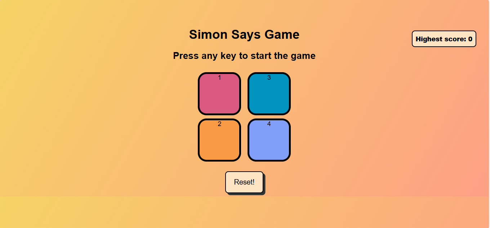

# 🎮 Simon Says Game

A fun and interactive memory game built using **HTML**, **CSS**, and **JavaScript**. This is a browser-based version of the classic _Simon Says_ game where users must memorize and repeat an ever-growing sequence of colors.

---

## 📌 Features

- 🎨 Four colorful buttons with engaging animations and sounds
- 🧠 Progressive difficulty with increasing sequences
- 💻 Fully responsive and works in modern browsers
- 🚫 Game resets on wrong input

---

## 🛠️ Tech Stack

- **Frontend:** HTML5, CSS3, JavaScript (Vanilla)
- **IDE:** Visual Studio Code

---

## 🚀 How to Run

1. Clone the repository or download the source code.
2. Open the folder in **VS Code**.
3. Open the `index.html` file in a browser.
4. Press any key to start the game!

---

## 🎯 Gameplay Instructions

1. The game starts when you press any key.
2. A random color will flash – memorize the sequence.
3. Click the buttons in the exact same order.
4. With every correct round, a new color is added to the sequence.
5. If you click the wrong color, the game ends and restarts.

---

## 🖼️ Preview

---

## 📂 File Structure

simon-says-game/
├── index.html
├── styles.css
├── script.js
├── assets/
│ ├── preview.png
└── README.md

---

## 💡 Inspiration

This project is inspired by the classic _Simon Game_ and serves as a fun way to practice DOM manipulation, event handling, and sound integration using JavaScript.

---

## 🧑‍💻 Author

**Ghousia Mulla**  
You can call me Zoya
Aspiring Full Stack Developer | Passionate about Web & Game Dev  
[LinkedIn](https://www.linkedin.com/in/mghousia) • [GitHub](https://github.com/ghousiadreams)

---
